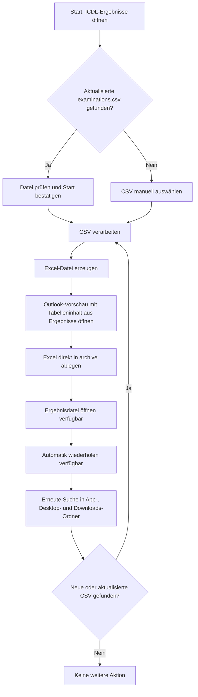
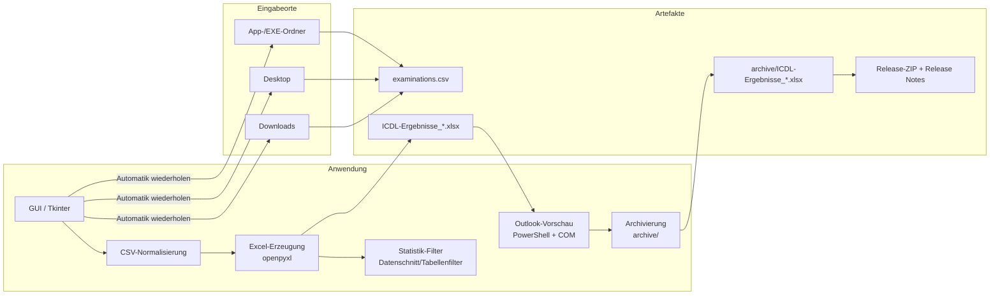

# ICDL-Ergebnisse – Diagrammdokumentation

Diese Seite bündelt die wichtigsten Abläufe als Mermaid-Diagramme und verweist auf die gerenderten SVG-Dateien.

## Anwenderablauf

## Technischer Überblick

## Hinweise

- Die Mermaid-Quellen liegen zusätzlich als `.mmd`-Dateien unter `docs/diagramme/`.
- Die SVG-Diagramme eignen sich gut für Markdown und Release-Dokumentationen, weil sie verlustfrei skalieren und auch bei Vergrößerung scharf bleiben.
- Für die Build-Ausgabe werden die Doku-Dateien weiterhin mitkopiert; die Diagramm-Bilder liegen damit ebenfalls im Build.
